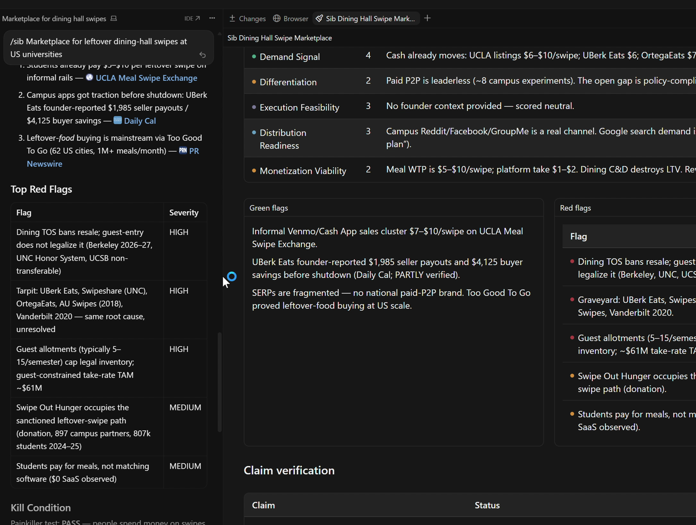

<p align="center">
  
</p>

<h1 align="center">Should I Build?</h1>

<p align="center">
  <b>Claude will tell you to build it. This skill is not allowed to.</b><br />
  Six research agents. One claim verifier. A scorecard.<br />
  The only legal answers are BUILD, CONDITIONAL, PIVOT, or STOP.
</p>

<p align="center">
  <a href="https://skills.sh/Endokelp/Should-I-build/should-i-build"></a>
  <a href="https://github.com/Endokelp/Should-I-build/blob/main/SIBdemo.mp4"></a>
  <a href="https://github.com/Endokelp/DecisionCouncil"></a>
</p>

<p align="center">
  <a href="#install">Install</a>
  &nbsp;·&nbsp;
  <a href="SIBdemo.mp4">Demo</a>
  &nbsp;·&nbsp;
  <a href="#usage">Usage</a>
  &nbsp;·&nbsp;
  <a href="https://github.com/Endokelp/DecisionCouncil">Council</a>
</p>

<p align="center">
  <a href="SIBdemo.mp4">
    
  </a>
</p>

<p align="center"><a href="https://github.com/Endokelp/Should-I-build/blob/main/SIBdemo.mp4"><b>Watch the 1-minute demo</b></a> (a 9-minute run, sped up)</p>

Most idea validation is a vibe. You describe the product. The model hyped you. Your friends are polite. Three months later you find out nobody would pay, or the channel is dead, or five startups already died on this exact hill.

Should I Build is the other shape. It is not allowed to encourage you. It has to go look: Reddit, search demand, competitors, market size, willingness to pay, timing. Then a separate agent fact-checks the numbers the first six just produced. Then it scores seven pillars and picks a verdict.

STOP is a win. It just saved you a quarter.

> **Works in** [Claude Code](https://claude.ai/code) and [Cursor](https://cursor.com). No server. No account. Inference is the assistant you already pay for.

## Why it is built this way

Three constraints.

1. **The model that writes the plan cannot grade the plan.** Same session will call a tarpit a "great opportunity." Research and scoring have to happen in fresh sub-agents with a forced output contract.
2. **Opinions are not evidence.** Every score cell needs a source. Hallucinated TAM gets tagged FALSE before it can move the verdict.
3. **Token cost has to stay bounded.** Six Wave 1 agents run in parallel, each capped. `last30days` is only used by Community. `deep-research` is only used by Claim Verifier. They are never cross-used.

What that produces is unusual for a skill: a mean one. Encouragement is a bug.

## What it does

| Piece | What you get |
|---|---|
| **Community signal** | Fresh 30-day pain threads across Reddit, X, HN, YouTube, TikTok via `last30days` |
| **Search demand** | Whether anyone is looking, and what the SERP already owns |
| **Competitive intel** | Who exists, what 2-star reviews actually complain about |
| **Market size** | Bottom-up TAM/SAM/SOM with the method visible, not a vibes number |
| **Willingness to pay** | Paid tools, workaround cost, painkiller vs vitamin |
| **Timing** | Why now, proxy companies, tarpit check |
| **Claim verifier** | Contested numbers marked VERIFIED / PARTLY / FALSE / UNVERIFIABLE |

Then a 7-pillar scorecard and one of four verdicts. Not a paragraph that says "it depends."

## Install

```bash
npx skills add Endokelp/Should-I-build --skill should-i-build -g -y
npx skills add mvanhorn/last30days-skill --skill last30days -g -y
npx skills add 199-biotechnologies/claude-deep-research-skill --skill deep-research -g -y
```

Or all three at once:

```bash
# macOS / Linux
bash <(curl -s https://raw.githubusercontent.com/Endokelp/Should-I-build/main/install.sh)
```

```powershell
# Windows
irm https://raw.githubusercontent.com/Endokelp/Should-I-build/main/install.ps1 | iex
```

```bash
npx skills list
# should show: should-i-build, last30days, deep-research
```

No API key required. Set `SCRAPECREATORS_API_KEY` only if you want richer `last30days` coverage.

## Usage

Be specific. Vague ideas get vague verdicts.

```
/sib A Chrome extension that auto-applies to every LinkedIn job using your resume
```

```
should i build this: leftover dining-hall swipe marketplace at US universities
```

```
/sib quick an AI that writes tweets from voice notes
```

`/sib quick` is three analysts, no claim verifier. Directional only.

**Good:** targeting, frequency, who pays.

```
/sib A browser extension that auto-fills LinkedIn apps from a resume,
targeting developers applying to 30+ jobs a week.
```

**Too vague:**

```
/sib an AI tool for job seekers
```

## Verdict scale

| Score | Verdict | What to do |
|---|---|---|
| 30–35 | **BUILD** | Smallest version, this week |
| 22–29 | **CONDITIONAL** | Named gap. Close that gap before you write code |
| 15–21 | **PIVOT** | Pain may be real. Approach, ICP, or pricing is wrong |
| < 15 | **STOP** | Demand failed. Stop is the successful outcome |

If Demand Signal scores 0 or 1, the verdict is **STOP** no matter what the rest of the card says. A beautiful product in a vitamin market is still a vitamin.

The demo above is a real run: dining-hall swipe marketplace. Demand passed. Policy and a graveyard of dead campus apps did not. **PIVOT**, not BUILD.

## How a run works

```
You describe the idea
        │
Step 0  │  Frame: customer, problem, mechanic, why now
        │
Wave 1  ├── Community     → last30days
        ├── Search demand
        ├── Competitive
        ├── Market size
        ├── Willingness to pay
        └── Timing
        │   (all six in parallel)
        │
Wave 2  └── Claim verifier → deep-research Quick
        │
Step 3  │  Score seven pillars. Apply kill condition. Verdict.
```

Wall-clock time is the slowest agent, not the sum of six.

## Files

```
Should-I-build/
├── SIBdemo.mp4          ← 1-minute demo (real run, sped up)
├── sib-hero.png
├── logo.svg
├── should-i-build/
│   ├── SKILL.md         ← procedure, triggers, wave checklist
│   ├── AGENTS.md        ← 6 analysts + Claim Verifier
│   └── VERDICT.md       ← scoring rubric
├── install.sh
├── install.ps1
└── README.md
```

## Related

Once demand is real and the fork is expensive, use [DecisionCouncil](https://github.com/Endokelp/DecisionCouncil). Advocate vs Skeptic, ranked #1, dissent left in.

New to agent skills? Start with [Only Skill You Need](https://github.com/Endokelp/Only-Skill-You-Need). It installs the rest.

Standalone companions: [last30days](https://github.com/mvanhorn/last30days-skill), [deep-research](https://github.com/199-biotechnologies/claude-deep-research-skill).

## License

MIT. Use it, fork it, tell people to STOP.

Methodology behind the scorecard: YC Startup School, Steve Blank, *The Mom Test*, Sean Ellis PMF, Jobs-to-be-Done.
